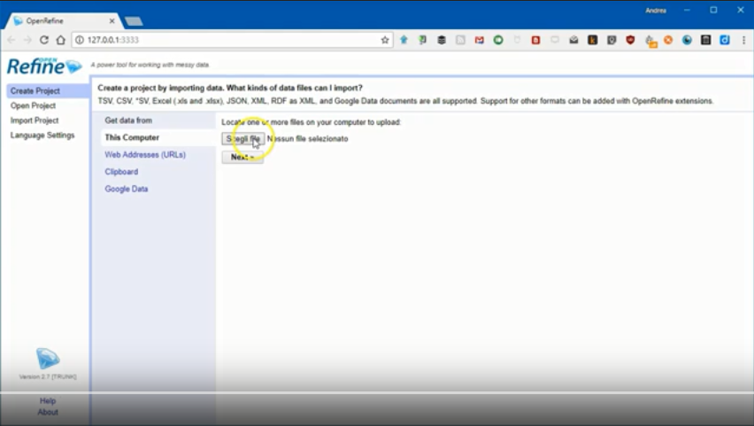

<!-- TOC -->

- [Introduzione](#introduzione)
- [Perché è utile](#perché-è-utile)
- [Come fare](#come-fare)
    - [Con OpenRefine e le API di Nominatim](#con-openrefine-e-le-api-di-nominatim)
        - [Note e riferimenti](#note-e-riferimenti)
    - [Con OpenRefine e le API di Google](#con-openrefine-e-le-api-di-google)
        - [Note e riferimenti](#note-e-riferimenti-1)

<!-- /TOC -->
# Introduzione

Il _geocoding_ è la trasformazione di una stringa (`Via Libertà 92, Palermo`) in una coppia di coordinate (`38.140157, 13.345594`).

# Perché è utile

Molto spesso si hanno a disposizione elenchi di indirizzi. Sono dati quindi riferibili a dei luoghi, ma che non si possono usare per creare subito una mappa.

Come ad esempio i dati sottostanti, relativi ad alcuni beni immobili sequestrati alle mafie in Sardegna.

| m_bene      | regione  | provincia | comune            | indirizzo              | 
|-------------|----------|-----------|-------------------|------------------------| 
| I-SS-111490 | Sardegna | Sassari   | Alghero           | VIA EUROPA N. 85       | 
| I-SS-111484 | Sardegna | Sassari   | Sassari           | VIALE UMBERTO I, N. 68 | 
| I-SS-122176 | Sardegna | Sassari   | Sassari           | VIA DALMAZIA N. 21     | 
| I-SS-122189 | Sardegna | Sassari   | Sassari           | VIALE UMBERTO I N. 68  | 
| I-CA-178778 | Sardegna | Cagliari  | Quartu Sant'Elena | VIA IRLANDA 58         | 

# Come fare

## Con OpenRefine e le API di Nominatim

[**OpenRefine**](../tools/openrefine.md) è uno strumento classico per "fare cose" con i dati e le [**API di Nominatim**](http://wiki.openstreetmap.org/wiki/Nominatim) sono uno dei servizi con cui è possibile fare il _geocoding_ di un indirizzo.

Nel video sottostante è illustrata la procedura:

- si crea un progetto in OpenRefine importando la tabella che contiene gli indirizzi ([qui](./data/immobiliOpenRegioSardegna.csv) il file usato nel video);
- si aggiunge una colonna che verrà usata per fare il _geocoding_ (**si deve chiamare "2geocode"**), in modo che il dato di input contenga sia l'indirizzo, che il comune di riferimento (altrimenti il _geocoding_ sarebbe impossibile), con la formula `value + ', ' + cells["comune"].value + ', Italia'`
- si lancia la procedura di _geocoding_ usando delle [istruzioni](https://github.com/aborruso/geocode_openrefine/blob/master/Nominatim/open_refine_nominatim.json) scritte da [**Andrea Zedda**](https://twitter.com/andria_tzedda);
- si esporta l'output come foglio elettronico.

### Note e riferimenti

- il _geocoding_ di Nominatim è basato sul database di [**OpenStreetMap**](https://www.openstreetmap.org/#map=19/38.12672/13.29924), quindi i risultati non saranno soddisfacenti in quei luoghi per cui in OSM ci sono pochi dati o di scarsa qualità;
- [qui](https://operations.osmfoundation.org/policies/nominatim/) le linee di condotta sull'utilizzo delle API;
- ai dati di output si applica la licenza di [OpenStreetMap](http://www.openstreetmap.org/copyright);
- prima di eseguire qualsiasi procedura di _geocoding_ è opportuno fare sempre un po' di pulizia dei dati.

## Con OpenRefine e le API di Google

La stessa procedura è replicabile con OpenRegine, utilizzando altri servizi di _geocoding_. A seguire è illustrato come sfruttare le [API di Google Maps](https://developers.google.com/maps/documentation/geocoding/intro).

La procedura è pressoché identica:

- si crea un progetto in OpenRefine importando la tabella che contiene gli indirizzi ([qui](./data/immobiliOpenRegioSardegna.csv) il file usato nel video);
- si aggiunge una colonna che verrà usata per fare il _geocoding_(**si deve chiamare "2geocode"**), in modo che il dato di input contenga sia l'indirizzo, che il comune di riferimento (altrimenti il _geocoding_ sarebbe impossibile), con la formula `value + ', ' + cells["comune"].value + ', Italia'`
- si lancia la procedura di _geocoding_ usando delle [istruzioni](https://github.com/aborruso/geocode_openrefine/blob/master/Google/open_refine.json) scritte da [**Andrea Borruso**](https://twitter.com/aborruso);
- si esporta l'output come foglio elettronico.

Nell'output saranno presenti non soltanto le colonne delle coordinate, ma anche altre, tra cui "*types*". Ci sono diverse varietà di *types*, tra cui

* administrative_area_level_3 
* bus_station 
* church 
* establishment 
* locality 
* neighborhood 
* point_of_interest 
* post_office 
* premise 
* route 
* stadium 
* street_address 
* sublocality 
* ...

Conoscere il type è utile, perché restituisce in qualche modo anche informazioni sulla qualità del risultato. Se ad esempio a partire da un indirizzo si ottiene "types=locality", si tratterà di qualcosa molto genericamente posizionato nel centroide di una porzione di territorio.

L'altra proprietà interessante dell'output prodotto è "location_type":

* "**ROOFTOP**" indicates that the returned result is a precise geocode for which we have location information accurate down to street address precision. 
* "**RANGE_INTERPOLATED**" indicates that the returned result reflects an approximation (usually on a road) interpolated between two precise points (such as intersections). Interpolated results are generally returned when rooftop geocodes are unavailable for a street address. 
* "GEOMETRIC_CENTER" indicates that the returned result is the geometric center of a result such as a polyline (for example, a street) or polygon (region). 
* "APPROXIMATE" indicates that the returned result is approximate. -

In grassetto i "*location_type*" che si possono considerare corrispondenti a operazioni di geocoding, il cui è output è posizionato geograficamente in modo più appropriato.

### Note e riferimenti

- Il limite di richieste possibili - per la versione free - tramite Google Maps è di **2500 al giorno** dallo stesso IP;
- la licenza delle API **non si presta per la produzione di dati aperti**, perché obbliga a riutilizzare i dati di output sulle sole mappe di Google Maps;
- prima di eseguire qualsiasi procedura di _geocoding_ è opportuno fare sempre un po' di pulizia dei dati.