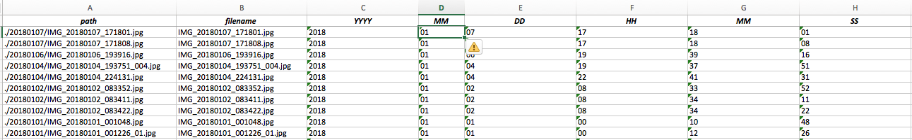

<!-- TOC -->
- [Introduzione](#introduzione)
- [Perché è utile](#perché-è-utile)
- [Come fare](#come-fare)
<!-- /TOC -->
# Introduzione

Le fotografie digitali, scattate con la fotocamera o il telefonino, contengono molte utili [informazioni](https://it.wikipedia.org/wiki/Exchangeable_image_file_format) riguardo, ad esempio, la data di scatto e il luogo in cui la foto è stata ripresa. 

# Perché è utile

Purtroppo con le foto riprese dai telefoni di qualche anno fa a volte capita che questi dati non siano scritti all'interno dell'immagine, ma nel nome del file, ad esempio

**IMG_20160903_123151.jpg**

è una foto ripresa il 3 settembre del 2016, alle ore 12:31:51, il file contiene infatti queste informazioni secondo questa codifica

**IMG_YYYYMMDD_HHMMSS.jpg**

per poter ricercare l'immagine per data, operazione utile per la gestione di un archivio fotografico tramite, ad esempio, programmi come Adobe Lightroom, è necessario leggere per ogni immagine i dati dal **nome file** e scriverli nei **metadati EXIF**.
Per questa operazione possiamo utilizzare uno strumento estremamente potente e versatile, **[Exiftool](https://en.wikipedia.org/wiki/ExifTool)**.

# Come fare
## Prerequisiti

* Installazione degli **[Exiftool](http://owl.phy.queensu.ca/~phil/exiftool/)** 
* Disponibilità di un editor per fogli di calcolo (Libre Office, Excel)

## Creiamo una lista dei file da processare
Supponiamo, per semplicità, che i file si trovino nella stessa cartella, attraverso un terminale a riga di comando (linux, mac) scriviamo

```
ls IMG*.jpg > lista_file.csv
```
in windows possiamo usare, dalla riga di comando, queste istruzioni

```
dir IMG*.jpg > lista_file.csv
```
otteniamo così un file che possiamo aprire con un foglio di calcolo ed elaborare, attraverso la funzione *dati in colonna* per separare i valori di anno, mese, giorno, ora, minuti e secondi



creaiamo una istruzione di **Exiftool** per ogni riga, la cosa potrebbe essere automatizzata con uno script, ma questa operazione tramite il foglio di calcolo ci consente di controllare i valori che verranno scritti in maniera più immediata.

nel foglio di calcolo componiamo una funzione che prende in pasto i valori e li combina con l'apposito comendo di **Exiftool**, che nel mio caso è

`="exiftool -xmp:dateTimeOriginal="""&C2&":"&D2&":"&E2&" "&F2&":"&G2&":"&H2&""""&" "&A2`

estendiamo la formula per tulle le righe e copiamo il risultato in un editor di testo, inserendo (mac o linux) questa prima riga

`#!/bin/bash`

e salvando il file come **.sh**

`insert_datetime_exif.sh`

ora occorre dare i diritti di esecuzione e lanciare lo script

`chmod +x ./insert_datetime_exif.sh`

`./insert_datetime_exif.sh`

su sistemi windows si copia il contenuto del foglio di calcolo in un editor di testo, non occorre in questo caso aggiungere la riga *#!/bin/bash* e si salva il file con estensione **.bat**

`insert_datetime_exif.bat`

e si lancia lo script scivendo il nome del file e premendo invio.

### Note e riferimenti

* [Esempio di foglio di calcolo](.data/aggiorna_exif_nome_file.xlsx)
* [Esempio di script per mac e linux](.data/insert_datetime_exif.sh)
* [Esempio di scipt per windows](.data/insert_datetime_exif.bat)